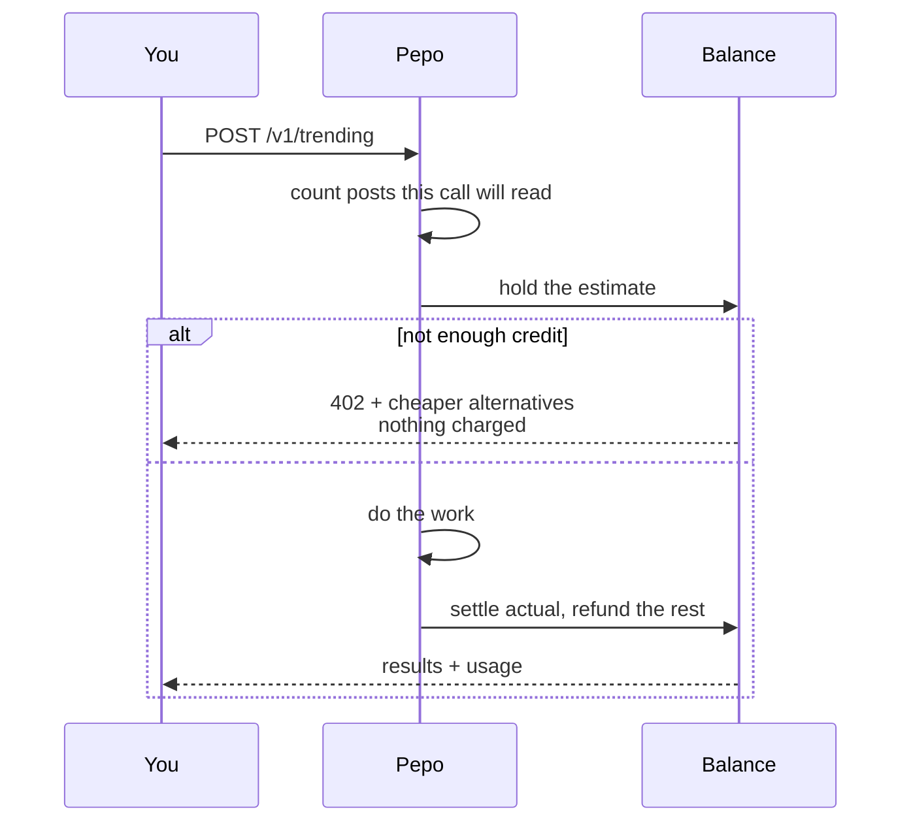

Pepo bills against a prepaid dollar balance. There is no subscription and no seat count; you load credits and calls draw them down.

Two guardrails, not one, because a balance alone does not stop a single call from consuming all of it.

<CardGroup cols={2}>
  <Card title="Balance" icon="wallet">
    A call whose estimate exceeds your remaining balance is refused **before any work starts**, and nothing is charged.
  </Card>
  <Card title="Per-call ceiling" icon="gauge">
    Every metered endpoint takes `max_cost_usd`, with a server default when you omit it. Work stops at the ceiling and returns partial results rather than overrunning.
  </Card>
</CardGroup>

## Reading the meter

You cannot see a dashboard from inside a chat client, so the meter travels with the payload. Every metered response carries headers and a `usage` block:

```http
X-Pepo-Cost-Usd: 0.8340
X-Pepo-Balance-Usd: 19.1660
X-Pepo-Request-Id: req_a16f58106b2a4b90a9a1c64e90858e3c
```

```json
"usage": {
  "cost_usd": 0.834,
  "balance_usd": 19.166,
  "billed": [
    { "unit": "search_request",   "quantity": 1,   "unit_cost_usd": 0.01,  "cost_usd": 0.01 },
    { "unit": "content_enriched", "quantity": 412, "unit_cost_usd": 0.002, "cost_usd": 0.824 }
  ],
  "truncated": false
}
```

`truncated: true` means the call hit its ceiling. The results are partial and that is not an error — reduce scope or raise `max_cost_usd`.

## Billing units

Billed on the unit the underlying cost actually tracks, so what you pay does not depend on how you phrase a question.

| Unit | Price | What it counts |
|---|---|---|
| `search_request` | $0.010 | One query against your corpus |
| `content_enriched` | $0.002 | One post read and analysed |

### What actually drives the price

**How many posts a call reads**, not how many results it returns. A trending call over 412 posts costs the same whether you ask for 10 results or 100.

That makes the levers straightforward:

| To spend less | Effect |
|---|---|
| Narrow `window` | Reads fewer posts. The biggest lever. |
| Restrict `platforms` | Reads only that platform's posts |
| Change `limit` | **No effect on cost** |

Because Pepo can count the posts a call will read before running it, the estimate is exact rather than a guess — `estimate` and `usage.cost_usd` agree.

## Estimate first

`POST /v1/estimate` is free and returns a band with its assumptions:

```json
{
  "estimate": {
    "cost_usd": { "low": 0.83, "expected": 0.83, "high": 0.83 },
    "assumes": { "posts_considered": 412, "videos_returned": 25 },
    "balance_usd": 20.0,
    "affordable": true
  }
}
```

Low, expected and high are identical here because the corpus was counted. They widen only when a call's scope can't be counted in advance.

<Tip>
If you are driving Pepo from an agent, make `estimate` available to it. An agent that can price its own plan proposes the affordable version first, instead of discovering the ceiling by hitting it.
</Tip>

## Running out

A refused call returns `402` and carries a way forward:

```json
{
  "error": {
    "type": "insufficient_credits",
    "message": "This request is estimated at $5.00 and the workspace balance is $4.93.",
    "estimated_cost_usd": 5.0,
    "balance_usd": 4.934,
    "suggestions": [
      "Narrow `window` — this workspace holds 5000 matching posts and the balance covers about 2465 (roughly the most recent 49%).",
      "Restrict `platforms` to one platform — cost tracks how many posts are read, so a narrower platform set reads fewer.",
      "Add credits at https://app.pepo.ai/settings/billing"
    ]
  }
}
```

`suggestions` is computed against your actual balance and names the levers that actually move the price for this call. An error that says only "no" ends an agent's task; one that carries an affordable plan lets it continue.

Nothing is charged on a `402`. No work was started.

## Reconciliation




Reserve, work, settle: the estimate is held against your balance before work begins and the unspent part is refunded when the call completes. Two consequences worth knowing:

- Two large concurrent calls cannot both pass a balance check and jointly overdraw — the second is refused.
- Your balance may dip during a long call and recover when it settles. `GET /v1/credits` mid-flight can read lower than the eventual charge.

You are never billed above the ceiling you were quoted. Actual cost is clamped to the reservation, and any shortfall is reported as `truncated`.
